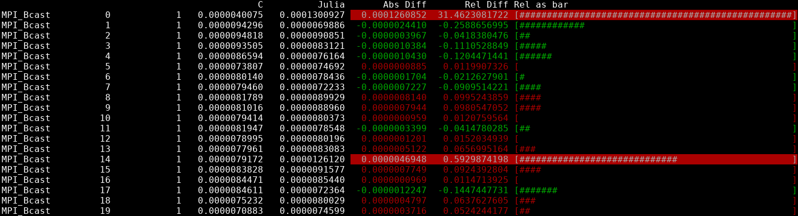

# cmp.jl
A basic way to compare output between two instances of [reproMPI](https://github.com/hunsa/reprompi).
It is intended to compare the performance between the [original](https://github.com/hunsa/reprompi) and the [Julia implementation](https://github.com/sebastian-steiner/reproMPI.jl)

## Options
If only one file is specified, then the other one is inferred by swapping the starting c/jl for the other one. e.g. c4.out -> jl4.out

    -c, --c-output C-OUTPUT
       file in which c output is stored

    -j, --julia-output JULIA-OUTPUT
                          file in which julia output is stored

    -b, --bar-width BAR-WIDTH
                          the width of a bar visualising the relative
                          difference (type: Int64, default: 10)
                          
## Example output

